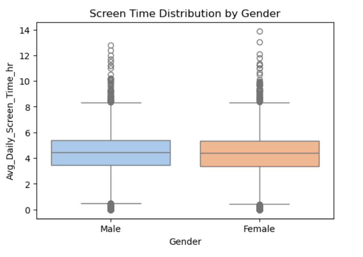
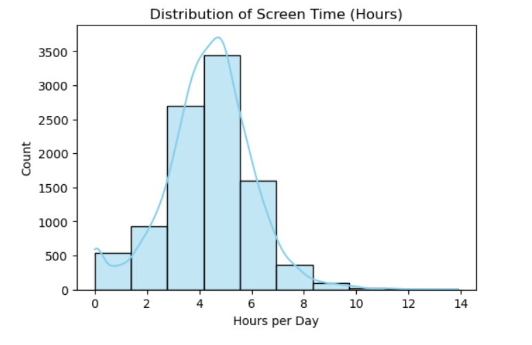
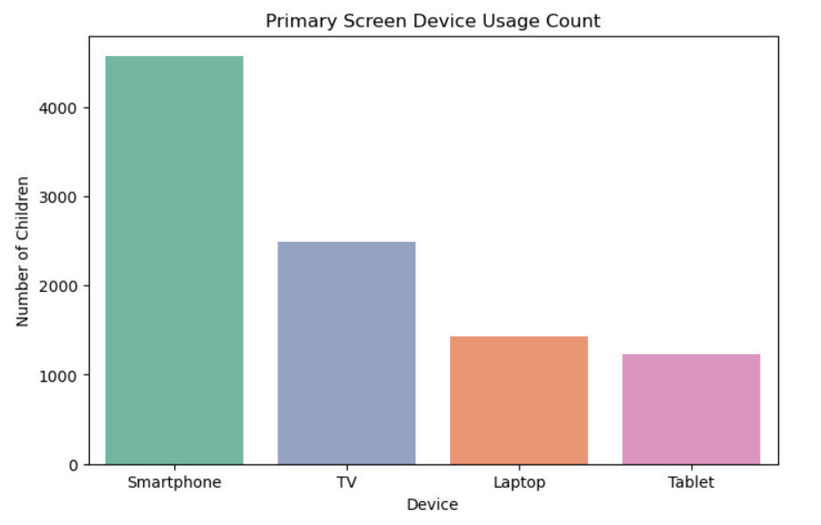
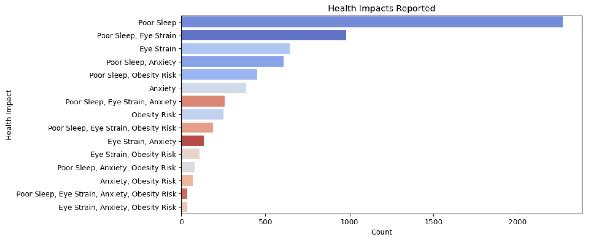
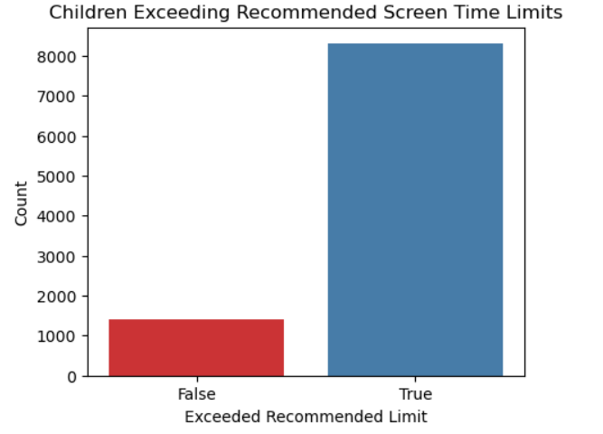

# Web Application
https://screen-time-analysis-35n9vc2d5qu3m2e8a2g5bc.streamlit.app/

# 🎬 Screen-time-analysis

Indian Kids' Daily Screen Time analysis through various platform usage and their localities.  
Their screen time was analyzed along with associated health impacts. 📱🧒👧

---

## 📁 Dataset

The dataset is sourced from Kaggle: **`indian-kids-screentime-2025`**.  
It contains detailed data on screen time by age, gender, locality, devices, and health effects.

---

## 💻 JupyterLab Analysis

The analysis is performed in **JupyterLab** using **Python** and key libraries including **pandas**, **matplotlib**, and **seaborn**.

---

## 🔍 Process of Analysis

1. **Download Dataset:**  
   Download the dataset locally to ensure fast, offline access.
   
2. **Set Up Environment:**  
   Specify the directory for the dataset.

3. **Create Notebook:**  
   Create a `.ipynb` notebook in JupyterLab.

4. **Install Required Packages:**  
   Use `pip` or `conda` to install necessary libraries.

5. **Load Data:**  
   Load the dataset as a pandas DataFrame:
   ```
   df = pd.read_csv(r"C:\Users\Chabri Ganesh\Indian_Kids_Screen_Time.csv")
   print("📊 Data Preview:")
   print(df.head())
   print("\n📈 Summary Stats:")
   print(df.describe())

6. **Visualizations:**  
- **Average Screen Time by Age:**  
  Bar graph with color-coded age groups.  
  *Hue = age_group_mean.index (e.g., 8-10, 11-13)*
  .png)
- **Screen Time Distribution by Gender:**  
  Boxplot colored by gender categories.
  
- **Screen Time Distribution (Histogram):**  
  Distribution across all kids, no hue.
  
- **Primary Device Usage Count:**  
  Count plot colored by primary devices (smartphone, tablet, etc.).
  
- **Health Impacts Report:**  
  Count plot horizontally showing health issues, colored by category.
  
- **Exceeded Recommended Screen Time Limits:**  
  Count plot showing binary exceeded/not exceeded groups.
  

---

## 🚀 Web Application

- Create a folder `Screen-Time-app`.
- Add `app.py` to build the Streamlit web application.
- Implement data loading, filters (age, gender, locality), and graphs similar to notebook visualizations.
- Run the app locally using:
  ```
  streamlit run app.py
- Deploy on **Streamlit Cloud** for public access.

---

## 📚 Creating Repository & Deployment

- Use **GitHub Desktop** or CLI to add all project files to a GitHub repo.
- Push your changes to GitHub.
- In **Streamlit Cloud Community**:  
- Select "Create App"  
- Link your GitHub repository and specify the app file (`app.py`)
- Deploy the app live for public use.

---

## 🎉 Conclusion

This project gives valuable insights on how Indian kids use digital devices daily and the health impacts associated with screen time.  
Interactive visuals and filters empower users to explore the data deeply!  

---

*Happy Analyzing and Visualizing! 📊📈🎨*

